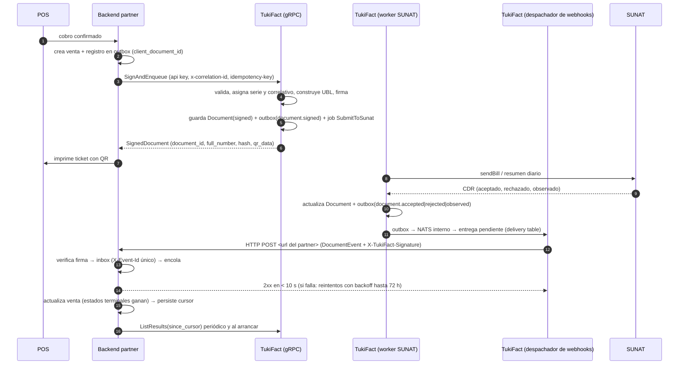

# Emisión de comprobantes para proyectos partner

Estado: contrato v1 cerrado en su forma; implementación en curso en TukiFact. Fecha: 2026-09-16.

Decisión 2026-09-16: entrega por webhooks; NATS interno, sin exposición a internet.

Este documento describe cómo un proyecto externo (Market Real, ToroLoco) emite comprobantes electrónicos a través de TukiFact y cómo recibe el resultado de SUNAT. Aplica únicamente al módulo de facturación. Logística, retenciones, percepciones, SIRE, cotizaciones y recurrentes son manejo interno de cada proyecto y no forman parte de este contrato.

## 1. Alcance

| Incluido | Excluido |
|---|---|
| Factura (01), boleta (03), nota de crédito (07), nota de débito (08) | Guía de remisión (GRE) |
| Comunicación de baja (RA) | Retenciones y percepciones |
| Consulta puntual y reconciliación por cursor | SIRE, cotizaciones, recurrentes |
| Resultado de SUNAT (CDR) por webhook firmado | Acceso a NATS de TukiFact (interno; no se expone a partners) |
| Representación impresa: hash y QR | Portal web de TukiFact para los tenants partner (pendiente de decisión) |

El resumen diario de boletas (RC) es responsabilidad interna de TukiFact. El partner recibe `document.accepted` cuando SUNAT acepta el resumen que contiene la boleta.

## 2. Actores y responsabilidades

```text
Caja / POS  →  backend del partner  →  TukiFact  →  SUNAT
                       ↑                    │
                       └── resultado (CDR) ─┘
```

- El POS nunca llama a TukiFact. El backend del partner es dueño de la venta, de los permisos y de su propio outbox.
- TukiFact es la única autoridad de numeración: asigna serie y correlativo. El partner envía el punto de emisión, nunca el número.
- TukiFact es dueño del certificado digital y de las credenciales SOL del emisor, de la firma, del envío a SUNAT y de la custodia de XML, CDR y PDF.

## 3. Modelo de cuentas

| Concepto | Definición |
|---|---|
| Partner | El proyecto integrador (Market Real, ToroLoco). Tiene una URL de webhook y un secreto propios (uno por partner, no por tenant) y una API key de partner para aprovisionar. |
| Tenant | Una empresa emisora, identificada por su RUC. Un tenant pertenece a un partner o es cliente directo de TukiFact. |
| API key de tenant | Credencial de máquina emitida al aprovisionar el tenant. Autentica todas las llamadas gRPC de ese RUC. |
| Punto de emisión | Identificador que el partner asigna a cada caja o sede. TukiFact mantiene una serie por punto de emisión y tipo de documento. |

Reglas para ToroLoco, que trabaja por sede:

- Una sede con RUC propio es un tenant propio, con su API key.
- Varias sedes con el mismo RUC comparten tenant y API key, y se distinguen por `emission_point`. Cada sede obtiene sus series.
- El contador local de correlativos del partner deja de ser fuente fiscal. La identidad del comprobante en el partner es `client_document_id`.

### 3.1 Plan Partner

Los tenants aprovisionados por un partner reciben el plan `partner-unlimited`:

| Atributo | Valor |
|---|---|
| Documentos por mes | Ilimitados |
| Facturación a TukiFact | Fuera de Culqi; acuerdo comercial con el partner |
| Alta | Solo por aprovisionamiento de partner o backoffice; no es autoservicio |
| Módulos habilitados | Facturación (01, 03, 07, 08, RA) |
| Módulos deshabilitados | GRE, retenciones, percepciones, SIRE, cotizaciones, recurrentes, IA |

La restricción se aplica en dos capas. El contrato solo expone `CpeService`, por lo que no existe RPC para otros módulos. Además, la autorización de TukiFact evalúa las funcionalidades del plan, así que una llamada REST a un módulo deshabilitado responde `Tenant.PlanFeatureDisabled`.

## 4. Las tres piezas del contrato

| Pieza | Mecanismo | Obligatoria | Para qué |
|---|---|---|---|
| `SignAndEnqueue` | gRPC | Sí | Firmar, numerar y encolar el envío a SUNAT. Devuelve hash y QR en milisegundos. |
| `DocumentEvent` | Webhook HTTPS firmado, una URL y un secreto por partner | Sí | Recibir el resultado de SUNAT sin hacer polling. Entrega durable con reintentos hasta 72 h. |
| `ListResults(since_cursor)` | gRPC | Sí | Reconciliar por cursor si el consumidor estuvo caído o si una entrega agotó sus reintentos. |

Las tres son obligatorias. El pull no es opcional: es lo que garantiza que un CDR no se pierda.

Reglas comunes:

- El `.proto` es la fuente única del contrato. Cada proyecto genera su cliente; nadie escribe DTOs a mano.
- Los eventos van en JSON canónico de protobuf con headers HTTP explícitos. Sin envelopes de ninguna librería.
- Cada consumidor tiene un inbox con constraint de dominio detrás. La firma y el `X-Event-Id` son la primera línea; la garantía es la base de datos.
- Una URL de webhook y un secreto por partner, no por tenant. Los eventos llevan el tenant en header y en payload; ToroLoco y Market Real no se ven entre sí.
- NATS JetStream queda interno a TukiFact (outbox → NATS → handlers propios). No se expone a internet y no forma parte del contrato.
- Versión en el paquete, en el servicio y en el header `X-Schema-Version`: `tukifact.v1`. Los cambios son aditivos; una ruptura convive como `v2`.

## 5. Flujo de emisión



### 5.1 Paso a paso

1. **Cobro**. El backend del partner registra la venta y un registro de outbox propio con `client_document_id`. Ese identificador es la idempotency key de toda la operación.
2. **SignAndEnqueue**. Metadata obligatoria: `authorization: ApiKey <tk_...>`, `x-correlation-id`, `idempotency-key` igual a `client_document_id`. El cuerpo lleva tipo de documento, punto de emisión, moneda, cliente e ítems. Para 07 y 08 lleva además la referencia al documento afectado y el motivo.
3. **Dentro de TukiFact, en una sola transacción**: validación, verificación de plan y de certificado vigente, asignación de serie y correlativo con bloqueo por serie, construcción del XML UBL, firma con el certificado del tenant, cálculo de hash y QR, persistencia del documento en estado `signed`, escritura del evento `document.signed` y del trabajo `SubmitToSunat` en el outbox. Si algo falla, no se consume correlativo.
4. **Respuesta**. `SignedDocument` con `document_id`, `serie`, `correlative`, `full_number`, `hash_code`, `qr_data`, `status = signed`. Objetivo de latencia: menos de 300 ms. Una repetición con la misma `idempotency-key` devuelve el mismo documento con `idempotent_replay = true`. La misma key con un cuerpo distinto responde `ABORTED` con `code = Idempotency.PayloadMismatch`.
5. **Envío a SUNAT**. Un worker toma el trabajo. Facturas, notas y bajas van individualmente; boletas van por resumen diario. El worker persiste el CDR, actualiza el estado a `accepted`, `rejected` u `observed` y escribe el evento correspondiente en el outbox. Si SUNAT no responde, el worker consulta el estado con el ticket o `getStatusCDR` antes de reintentar; nunca reenvía a ciegas.
6. **Entrega**. El despachador de webhooks toma el evento del outbox (NATS interno a TukiFact) y crea una entrega durable en la tabla de deliveries. Hace `POST` a la URL del partner con el `DocumentEvent` en JSON canónico, los headers de la sección 6 y la firma `X-TukiFact-Signature`. Si no recibe `2xx` en 10 segundos, reintenta con backoff exponencial hasta 72 h; agotados, marca la entrega como `failed` y la deja visible en el backoffice. Entrega al menos una vez; el orden no está garantizado bajo reintentos.
7. **Recepción**. El endpoint del partner verifica la firma y la ventana de 5 minutos, inserta `X-Event-Id` en su inbox con constraint único (si ya existe, responde `200` y descarta), encola el procesamiento y responde `2xx` de inmediato. Después, fuera de la petición, actualiza la venta aplicando la máquina de estados (los terminales ganan sobre `signed`) y persiste el `cursor`.
8. **Reconciliación**. Al arrancar y periódicamente (recomendado cada 5 minutos), el partner llama a `ListResults(since_cursor)` con el último cursor confirmado. El cursor es un entero monotónico por tenant asignado por el outbox de TukiFact, así que el orden es estable y no hay huecos. Es la vía de recuperación cuando una entrega quedó `failed`.

### 5.2 Estados del documento

| Estado | Significado | Evento |
|---|---|---|
| `signed` | Firmado y numerado; pendiente de envío | `document.signed` |
| `accepted` | SUNAT aceptó | `document.accepted` |
| `observed` | SUNAT aceptó con observaciones | `document.observed` |
| `rejected` | SUNAT rechazó; el correlativo queda consumido | `document.rejected` |
| `voided` | Baja aceptada por SUNAT | `document.voided` |

`rejected` es terminal. Corregir exige un documento nuevo.

### 5.3 Notas de crédito y débito

`SignAndEnqueue` con `document_type` 07 u 08 y `reference` con `document_id` o con la clave de negocio `document_type + full_number`. TukiFact valida que el documento afectado pertenezca al mismo tenant y esté aceptado.

### 5.4 Baja

`VoidDocument` devuelve el ticket de SUNAT. El resultado llega como `document.voided` o `document.rejected` con el motivo. La baja de boletas se resuelve por resumen diario de bajas, también interno a TukiFact.

## 6. Entrega por webhook

### 6.1 Endpoint

| Atributo | Valor |
|---|---|
| Alcance | Una URL y un secreto por partner, no por tenant. Los eventos llevan el tenant en header y en payload; ToroLoco con muchas sedes recibe todo en una sola URL. |
| Registro | Al aprovisionar el partner, desde el backoffice o la API de aprovisionamiento de partners. |
| Secreto | Se muestra una sola vez. Se rota con ventana de solapamiento: durante la rotación hay dos secretos válidos. Nunca vive en el repositorio. |

### 6.2 Request

| Atributo | Valor |
|---|---|
| Método y URL | `POST <url>` |
| `Content-Type` | `application/json` |
| Body | Mensaje `DocumentEvent` en JSON canónico de protobuf (camelCase). Incluye `cursor` para continuar con `ListResults`. |
| Ack | Cualquier `2xx` dentro de 10 segundos. El receptor encola y responde; nunca procesa lógica SUNAT en línea. |

Headers obligatorios:

| Header | Valor |
|---|---|
| `X-Event-Id` | `event_id` (UUID), clave de dedupe en el inbox del receptor |
| `X-Event-Type` | Igual al campo `event_type` |
| `X-Schema-Version` | `1` |
| `X-Tenant-Id` | Tenant emisor (también viaja en el payload) |
| `X-Correlation-Id` | El mismo que viajó en `SignAndEnqueue` |
| `X-Delivery-Attempt` | Número de intento, `1..n` |
| `traceparent` | Contexto W3C para la traza distribuida |
| `X-TukiFact-Signature` | `t=<unix seconds>,v1=<hex HMAC-SHA256(secret, "<t>.<raw body>")>` |

Verificación de firma: el receptor rechaza si `|now − t| > 5 minutos` o si la firma no coincide (protección contra replay). Durante una rotación acepta cualquiera de los dos secretos vigentes. Este formato con marca de tiempo reemplaza al `sha256=<hmac(body)>` del `WebhookDeliveryService` actual de TukiFact; v1 del contrato partner usa solo la forma con `t=`.

### 6.3 Reintentos

| Atributo | Valor |
|---|---|
| Origen | Tabla durable de entregas alimentada por el outbox de TukiFact |
| Backoff | 1 min, 5 min, 30 min, 2 h, 6 h y luego cada 12 h hasta 72 h |
| Agotamiento | La entrega queda `failed`, visible en el backoffice de TukiFact; el evento sigue recuperable con `ListResults` |
| Garantía | Al menos una vez. El orden **no** está garantizado bajo reintentos. |

### 6.4 Obligaciones del receptor

| Obligación | Detalle |
|---|---|
| Verificar firma | Antes de leer el body; rechazar con `401` si falla o si la marca de tiempo está fuera de la ventana |
| Inbox | Insertar `X-Event-Id` con constraint único; duplicado → `200` y descartar |
| Máquina de estados | Los estados terminales ganan: `accepted` / `observed` / `rejected` / `voided` sobre `signed` |
| Cursor | Persistir el `cursor` del último evento procesado |
| Reconciliación | `ListResults` al arrancar y periódicamente (recomendado cada 5 minutos) desde el último cursor |

## 7. Seguridad

- **gRPC**: TLS obligatorio; autenticación por API key de tenant en metadata `authorization`. La key resuelve el tenant; no se envía `x-tenant-id`. Rate limit por key.
- **Webhook**: solo HTTPS con TLS 1.2+. Firma HMAC-SHA256 con marca de tiempo en `X-TukiFact-Signature`; rechazo fuera de la ventana de 5 minutos. Allowlist opcional de las IPs de egreso de TukiFact en el partner. El secreto se entrega una vez, se rota con solapamiento y nunca vive en el repo.
- **NATS**: interno a TukiFact (outbox → NATS → handlers propios). El puerto no se expone a internet y NATS no forma parte del contrato público.
- **Datos**: los secretos del tenant (certificado, clave SOL) viven cifrados en TukiFact. El partner nunca los recibe ni los envía por el contrato.

## 8. Errores

`google.rpc.Status` con un `ErrorDetail` en `details`. El cliente ramifica por `code`, nunca por el texto.

| Categoría | gRPC status | Ejemplos de `code` |
|---|---|---|
| VALIDATION | `INVALID_ARGUMENT` | `SignAndEnqueue.Validation` con `field_errors` |
| UNAUTHORIZED | `UNAUTHENTICATED` | `ApiKey.Invalid`, `ApiKey.Revoked` |
| FORBIDDEN | `PERMISSION_DENIED` | `Tenant.PlanFeatureDisabled`, `Tenant.Suspended` |
| NOT_FOUND | `NOT_FOUND` | `Document.NotFound`, `Reference.NotFound` |
| CONFLICT | `ABORTED` | `Idempotency.PayloadMismatch`, `Series.Exhausted` |
| FAILURE | `INTERNAL` | `Tenant.CertificateMissing`, `Tenant.CertificateExpired` |

## 9. Trazabilidad

- `X-Correlation-Id` nace en el cobro del POS y se reutiliza en gRPC, en el outbox, en los headers del webhook y en la reconciliación.
- `traceparent` W3C viaja en la metadata gRPC y en los headers del webhook, de extremo a extremo. Los tres backends exportan OpenTelemetry al Grafana central. Los saltos asíncronos abren traza nueva con enlace a la traza padre.
- TukiFact guarda un registro de entregas por evento (intento, código de estado, latencia) y una línea de tiempo durable por documento (recibido, firmado, enviado, resultado SUNAT, evento publicado, entregas por webhook) consultable por `GetDocument` y desde el backoffice. Las trazas se muestrean y caducan; el registro de entregas y la línea de tiempo no.

## 10. Versionado

- Paquete `tukifact.v1`, servicio `tukifact.v1.CpeService`, header `X-Schema-Version: 1` en cada evento.
- Dentro de v1 se agregan campos; no se renumeran, borran ni cambian de significado.
- Un cambio incompatible nace como `tukifact.v2` y convive con v1 hasta que el último consumidor migre.
- Los eventos llevan `X-Schema-Version` en headers; el consumidor rechaza versiones que no conoce.

## 11. Cambios necesarios por repositorio

### TukiFact

| Cambio | Fase del plan de reestructuración |
|---|---|
| Handler de autenticación por API key y agregado `Partner` con aprovisionamiento de tenants y plan `partner-unlimited` | Identity (fase 2) |
| Endpoint de webhook y secreto a nivel de partner: registro en aprovisionamiento, secreto mostrado una vez, rotación con ventana de solapamiento | Identity (fase 2) |
| Gate de funcionalidades del plan en la autorización | Identity (fase 2) |
| Outbox transaccional + NATS interno (sin exposición a internet) + entrega durable de webhooks sobre el outbox: tabla de deliveries, backoff hasta 72 h, estado `failed` visible en backoffice, registro de entregas por evento | Kernel PR5 + fase 4 |
| Firma con marca de tiempo `X-TukiFact-Signature: t=...,v1=...` y headers `X-Event-*`; reemplaza al `sha256=<hmac(body)>` del `WebhookDeliveryService` actual para el contrato partner | Kernel PR5 + fase 4 |
| `SignAndEnqueue` partido en firmar ahora y enviar después; worker con `getStatusCDR`; resumen diario de boletas; cursor por tenant y `ListResults` | Invoicing (fase 4) |
| `CpeService` gRPC en la Presentation del módulo Invoicing sobre los mismos handlers que REST; `Grpc.AspNetCore` en CPM; HTTP/2 en Kestrel y en el proxy | Kernel PR4 (hooks) + fase 4 |
| Referencia de NC/ND por clave de negocio | Invoicing (fase 4) |
| Línea de tiempo durable del documento | Invoicing (fase 4) |
| `contracts/tukifact/v1/cpe.proto` renombrado al contrato cerrado: `SignAndEnqueue`, `ListResults`, eventos `signed/accepted/observed/rejected/voided` | Ahora |

### Market Real

- No existe módulo de ventas ni facturación todavía; el cliente gRPC va en la Infrastructure del módulo que emita.
- Agregar `Grpc.Net.Client`, `Grpc.Tools` y `Google.Protobuf` al `Directory.Packages.props`; `<Protobuf Include="…cpe.proto" GrpcServices="Client" />`.
- Endpoint HTTPS receptor del webhook (Minimal API) que verifica `X-TukiFact-Signature`, inserta `X-Event-Id` en una tabla inbox con constraint de dominio y responde `2xx`. Sin cliente NATS. Wolverine y RabbitMQ quedan internos; nunca tocan el contrato.
- Reconciliación con `ListResults` como job programado (recomendado cada 5 minutos) desde el último cursor persistido.

### ToroLoco

- Reemplazar el cliente REST previsto en `TukiFactPort` por un cliente gRPC (`@nestjs/microservices` con `@grpc/grpc-js` y `@grpc/proto-loader`, o `ts-proto`). El fake de contrato se rederiva del `.proto`.
- Mantener el receptor de webhook planificado, espejo del gate de Culqi: verificación de `X-TukiFact-Signature` con el secreto del partner, tabla inbox por `X-Event-Id`, respuesta `2xx` inmediata y procesamiento encolado. Sin `@nats-io/*`.
- Ajustar el modelo: API key por tenant (RUC), no por sede; `emission_point` por sede o caja; `invoice_counters` deja de ser fuente fiscal; `serie` y `correlativo` llegan en la respuesta.
- Conversión de céntimos a decimal string en la frontera; catálogo SUNAT completo de tipo de documento del receptor (6, 1, 4, 7, 0).
- Eliminar el polling `getStatus`; la reconciliación es `ListResults` como job programado desde el último cursor.

### Contrato compartido

Mientras no exista el repositorio de contratos, la copia autoritativa vive en `TukiFact/contracts/tukifact/v1/cpe.proto` y los otros dos repos mantienen una copia idéntica en la misma ruta relativa. Cualquier cambio entra primero en TukiFact.

## 12. Pendientes que no se resuelven escribiendo código

| Pendiente | Dueño |
|---|---|
| Tasa de ICBPER vigente y forma del resumen diario | Fiscal, TukiFact |
| Homologación por RUC: el certificado y las credenciales SOL de cada tenant partner se cargan por enlace de activación o los entrega el partner | Producto |
| Acceso de los tenants partner al portal web de TukiFact (solo lectura o ninguno) | Producto |
| Ventana de reintentos de webhook (72 h) frente al SLA de reconciliación de cada partner | Operaciones |
