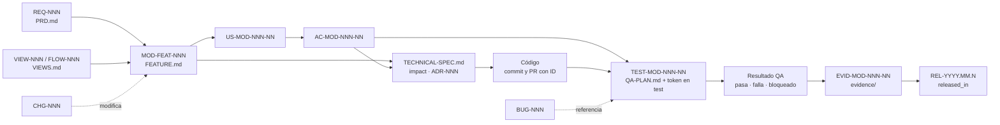

# Identificadores

**Nunca escribas un número a mano: pídelo con `trace next-id`.** Un ID se asigna una vez, no se reutiliza ni se renumera; deprecar es un estado, no un borrado. El formato exacto y las regex están en [traceability-schema.md §2](traceability-schema.md#2-identificadores).

## Camino rápido

```bash
trace new feature PAY "Registrar pago"          # crea PAY-FEAT-001 con sus 4 archivos
trace next-id US --feature PAY-FEAT-001         # US-PAY-001-01
trace next-id AC --feature PAY-FEAT-001         # AC-PAY-001-01
trace next-id TEST --feature PAY-FEAT-001       # TEST-PAY-001-01
trace new chg "Pago parcial" --feature PAY-FEAT-001   # CHG-004
trace check                                     # confirma que no hay duplicados
```

## Convención

| Tipo | Formato | Ámbito | Ejemplo | Dónde se declara |
|---|---|---|---|---|
| Módulo | 2–8 mayúsculas | registro | `PAY` | `docs/product/modules.yaml` |
| Requisito | `REQ-###` | global | `REQ-012` | tabla de `PRD.md` |
| Vista / flujo | `VIEW-###` / `FLOW-###` | global | `VIEW-004` | tabla de `VIEWS.md` |
| Feature | `<MOD>-FEAT-###` | por módulo | `PAY-FEAT-001` | frontmatter `id` de `FEATURE.md` |
| Historia | `US-<MOD>-###-##` | por feature | `US-PAY-001-01` | encabezado `###` en `FEATURE.md` |
| Criterio | `AC-<MOD>-###-##` | por feature | `AC-PAY-001-03` | encabezado `####` bajo su historia |
| Regla de negocio | `BR-<MOD>-###-##` | por feature | `BR-PAY-001-02` | tabla `Reglas de negocio` |
| Pregunta | `Q-<MOD>-###-##` | por feature | `Q-PAY-001-02` | tabla `Preguntas pendientes` |
| Suposición | `ASM-<MOD>-###-##` | por feature | `ASM-PAY-001-01` | tabla `Suposiciones` |
| Prueba | `TEST-<MOD>-###-##` | por feature | `TEST-PAY-001-07` | tabla `Casos de prueba` de `QA-PLAN.md` |
| Evidencia | `EVID-<MOD>-###-##` | por feature | `EVID-PAY-001-01` | tabla `Evidencias` de `QA-PLAN.md` |
| Cambio | `CHG-###` | global | `CHG-004` | frontmatter de `docs/changes/CHG-###-<slug>.md` |
| Incidencia | `BUG-###` | global | `BUG-017` | frontmatter de `docs/bugs/BUG-###-<slug>.md` |
| Decisión | `ADR-###` | global | `ADR-002` | frontmatter de `docs/adr/ADR-###-<slug>.md` |
| Pregunta de producto | `Q-PRD-###` | global | `Q-PRD-004` | tabla `Preguntas abiertas` de `PRD.md` |
| Release | `REL-YYYY.MM.N` | global | `REL-2026.10.1` | tabla `Releases` de `docs/product/RELEASES.md` (y tag Git en los repos liberados) |

Cómo leer un ID de feature: `AC-PAY-001-03` = criterio **03** del feature **PAY-FEAT-001**. El tooling deriva el feature a partir del ID.

## Declaración y referencia

| Concepto | Regla | Ejemplo |
|---|---|---|
| Declaración | El ID abre un encabezado o es la primera celda de una tabla designada. Una sola vez en todo `docs/`. | `#### AC-PAY-001-03 — Rechaza monto mayor al saldo` |
| Referencia | Cualquier otra aparición. Debe resolver a una declaración. | `\| TEST-PAY-001-07 \| AC-PAY-001-03 \| negativo \| …` |
| Token en tests | Literal en el nombre o metadato del test. | `[Trait("TestId", "TEST-PAY-001-07")]` |

> Consecuencia práctica: en `FUNCTIONAL-ANALYSIS.md` una vista se titula `## Vista: Cobro (VIEW-004)` y no `## VIEW-004 …`, porque la declaración ya está en `VIEWS.md`.

## Por qué US, AC y TEST son locales al feature

| Problema con numeración global | Cómo lo resuelve el ámbito por feature |
|---|---|
| Dos agentes trabajan en paralelo y ambos toman `AC-120` | Cada uno numera dentro de su feature: `AC-PAY-001-01` y `AC-INV-003-01` no colisionan |
| Un merge obliga a renumerar y rompe referencias en código y tests | No hay renumeración: el prefijo aísla |
| No se sabe a qué feature pertenece un TEST encontrado en el código | El ID lo dice: `TEST-PAY-001-07` → `PAY-FEAT-001` |

Los IDs **globales** (`REQ`, `VIEW`, `FLOW`, `CHG`, `BUG`, `ADR`) sí pueden colisionar entre ramas paralelas. Mitigación:

1. Pide el número con `trace next-id` justo antes de crear el documento, sobre `main` actualizado.
2. Integra el documento en un PR corto y dedicado (`docs(CHG-004): …`).
3. Si CI detecta duplicado tras un merge, **el último en integrarse renumera** su documento (aún no referenciado fuera de su PR).

## Procedimiento de asignación

- [ ] `main` actualizado (`git pull`) antes de pedir un ID global.
- [ ] El módulo existe en `modules.yaml`.
- [ ] ID obtenido con `trace next-id` o `trace new`.
- [ ] Declarado en el lugar indicado por la tabla de convención.
- [ ] `trace check` sin errores antes del commit.

## Cadena de trazabilidad



Cómo se recorre cada eslabón:

| Desde → hasta | Mecanismo |
|---|---|
| REQ/VIEW → FEAT | `prd_requirements`, `views` en frontmatter |
| FEAT → US → AC | Anidación de encabezados en `FEATURE.md` |
| AC → TECH SPEC | `spec_version` compartido y secciones `Contratos`, `Archivos a crear o modificar` |
| TECH SPEC → código | Commits `<type>(<ID>)` y título de PR ([07-git-y-ci.md](07-git-y-ci.md)) |
| AC → TEST | Columna `Criterios` de `Casos de prueba` |
| TEST → código de prueba | Columna `Automatización` + token literal |
| TEST → resultado → EVID | Columna `Resultado` y tabla `Evidencias` |
| FEAT → REL | `released_in`, `Liberado en` del CHANGELOG y fila del REL en `docs/product/RELEASES.md` |

La vista consolidada la genera `trace build`: [04-trazabilidad-y-dependencias.md](04-trazabilidad-y-dependencias.md).
