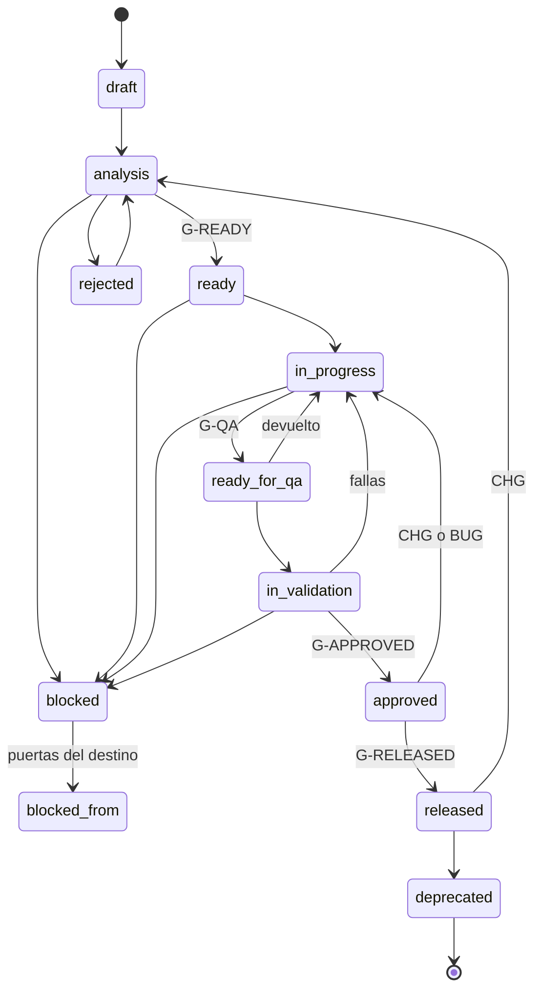

# Estados y puertas

**Un feature solo cambia de estado con `trace promote <ID> --to <estado>`, que evalúa la puerta del destino (y las anteriores del camino feliz) y, si pasa, edita el frontmatter.** `trace gate <ID> --to <estado>` hace la misma evaluación sin modificar nada. CI vuelve a validar el estado actual de cada feature en cada PR. La numeración de las puertas es la de [traceability-schema.md §6](traceability-schema.md).

## Camino rápido

1. `trace gate <ID> --to <estado>` → corrige las puertas que liste como fallidas.
2. `trace promote <ID> --to <estado>` → actualiza `status` y `updated` (y `blocked_reason`/`blocked_from` si aplica).
3. Commit `docs(<ID>): pasa a <estado>` en el mismo PR que aporta lo que exige la puerta.

No se edita `status` a mano: un cambio manual se salta la evaluación y CI lo rechazará si la puerta no se cumple.

## Estados

| Clave | Etiqueta | Siguiente permitido | Quién lo mueve |
|---|---|---|---|
| `draft` | Borrador | `analysis` | Analista |
| `analysis` | En análisis | `ready`, `blocked`, `rejected` | Analista (`ready` requiere spec del arquitecto `reviewed` y QA-PLAN de QA `ready`) |
| `ready` | Listo para desarrollo | `in-progress`, `blocked` | Desarrollador |
| `in-progress` | En desarrollo | `ready-for-qa`, `blocked` | Desarrollador |
| `ready-for-qa` | Listo para QA | `in-validation`, `in-progress` | QA |
| `in-validation` | En validación | `approved`, `blocked`, `in-progress` | QA |
| `blocked` | Bloqueado | el estado de `blocked_from` | Quien detecta el bloqueo; lo desbloquea quien lo resuelve |
| `rejected` | Rechazado | `analysis` | Analista con el solicitante |
| `approved` | Aprobado | `released`, `in-progress` (por CHG/BUG) | QA; `released` lo mueve el responsable de release |
| `released` | Liberado | `analysis` (por CHG), `deprecated` | Responsable de release / analista |
| `deprecated` | Deprecado | — | Analista con el arquitecto |

## Transiciones



> En el diagrama `in_progress`, `ready_for_qa` e `in_validation` representan las claves con guion; `blocked_from` representa el estado guardado en ese campo.

## Puertas como checklist

### G-READY — para pasar a `ready`

- [ ] **1.** Existen `FEATURE.md`, `TECHNICAL-SPEC.md`, `QA-PLAN.md` y `CHANGELOG.md` con frontmatter válido, y `spec_version` es idéntico en los tres documentos y en la primera entrada del CHANGELOG (la más reciente).
- [ ] **2.** Hay al menos una historia; cada historia tiene al menos un AC; cada AC tiene `Given`, `When` y `Then`.
- [ ] **3.** Ninguna pregunta con `Crítica = si` sigue `abierta`.
- [ ] **4.** `TECHNICAL-SPEC.status` es `reviewed` o `approved`; ningún H2 obligatorio vacío; `impact.modules_direct` no vacío.
- [ ] **5.** Cada AC está citado por al menos un TEST en `Casos de prueba`, y `QA-PLAN.status` ya no es `draft` (QA lo deja en `ready` al terminar el diseño durante `analysis`).
- [ ] **6.** Todo feature en `depends_on`, `related` e `impact.features_affected` existe; todo ADR de `adrs` existe y no está `superseded` ni `deprecated`.
- [ ] **7.** Todo `REQ` y `VIEW` citado existe en `PRD.md` / `VIEWS.md` (si esos archivos existen).

### G-QA — para pasar a `ready-for-qa`

- [ ] **8.** Todo TEST no manual tiene ruta de automatización (la completa el desarrollador).
- [ ] *(Humano, no automatizado)* PR integrados en los repos de `repos` y CI verde.
- [ ] *(Con `--code`)* **16.** Cada ruta de automatización existe y contiene el token del TEST.

### G-APPROVED — para pasar a `approved`

- [ ] **9.** Todo TEST con `Resultado = pasa`; toda fila de `Regresión` con `pasa`.
- [ ] **10.** `QA-PLAN.status = passed` y `last_run` con fecha.
- [ ] **11.** Al menos un `EVID` por cada TEST automatizado de nivel `e2e` y por cada TEST `manual`; los archivos locales existen.
- [ ] **12.** Ningún BUG del feature con severidad `critical` o `major` en `open`, `in-progress` o `fixed`.
- [ ] **13.** Cada `depends_on` está `approved` o `released`; o está en `ready-for-qa`/`in-validation` con `target_release` no vacío e igual al del feature.
- [ ] **14.** Todo CHG que liste el feature (directo o inducido) en estado `implemented` o posterior tiene su entrada en el CHANGELOG, y la entrada más reciente dice `Validación = aprobado`.

### G-RELEASED — para pasar a `released`

- [ ] **15.** `released_in` tiene un `REL-…` y coincide con `Liberado en` de la entrada vigente del CHANGELOG.

### G-BLOCKED / G-REJECTED

- [ ] `blocked_reason` no vacío.
- [ ] En `blocked`: `blocked_from` es un estado válido distinto de `blocked`.
- [ ] Salir de `blocked` exige las puertas del estado destino.

## Qué debe registrar un bloqueo

```bash
trace promote PAY-FEAT-001 --to blocked --reason "espera Q-PAY-001-04 (tope de pago parcial) — responde negocio"
```

| Dato | Dónde | Quién lo escribe |
|---|---|---|
| Motivo concreto y verificable | `blocked_reason` | `trace promote --reason` |
| Estado al que se vuelve | `blocked_from` | `trace promote` (estado actual) |
| Qué lo desbloquea | ID dentro de `blocked_reason`: `Q-…`, `<MOD>-FEAT-###`, `BUG-###`, `ADR-###` | Quien bloquea |
| Responsable de resolverlo | `blocked_reason` o la `Q-…` citada | Quien bloquea |
| Fecha | `updated` | `trace promote` |

Al desbloquear: `trace promote <ID> --to <blocked_from>`; evalúa las puertas de ese estado y limpia `blocked_reason` y `blocked_from`.

## Reglas de movimiento

- Nadie mueve un estado para "desbloquear" una puerta: se corrige el artefacto que falla.
- Reabrir un feature es **error G-TRANS** (no aviso) si falta la justificación; `trace gate`/`trace promote` lo rechazan ([05-gestion-de-cambios.md](05-gestion-de-cambios.md)):
  - `approved → in-progress` exige un `CHG` en `approved` que liste el feature (directo o inducido), o un `BUG` del feature en `open` o `in-progress`.
  - `released → analysis` exige un `CHG` en `proposed`, `analysis` o `approved` que liste el feature. Un BUG no basta.
- QA es el único que marca `approved`; el desarrollador nunca aprueba su propio feature.
- Un `CHG` sobre un feature `released` lo devuelve a `analysis` con `spec_version` incrementado.
- `target_release` se fija como tarde al entrar en `in-validation` si el feature se libera junto con una dependencia aún no aprobada.
