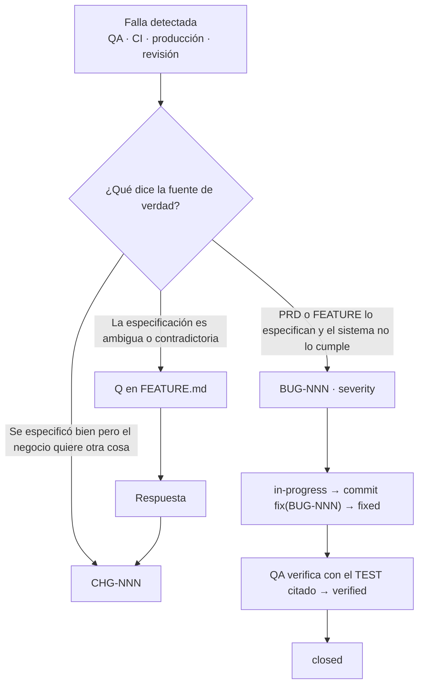

# Gestión de cambios, versiones e incidencias

**Todo cambio de comportamiento de un feature ya `ready` o posterior entra por un `CHG-###`; toda desviación de lo especificado entra por un `BUG-###`.** El CHG incrementa `spec_version` de cada feature afectado y deja una entrada en su `CHANGELOG.md`.

| Situación | Documento |
|---|---|
| El negocio pide algo distinto a lo especificado | `CHG` |
| La implementación no cumple lo especificado | `BUG` |
| Lo especificado es ambiguo o contradictorio | `Q-…` en el feature (y luego `CHG` si cambia el AC) |
| Se toma una decisión técnica nueva | `ADR` |
| Feature aún en `draft` o `analysis` | Se edita directo, sin CHG |

## Proceso de cambio (13 pasos)

| # | Paso | Dueño | Resultado | Estado CHG |
|---|---|---|---|---|
| 1 | Registrar la solicitud: `trace new chg "<título>" --feature <ID>` | Analista | `docs/changes/CHG-###-<slug>.md` | `proposed` |
| 2 | Redactar `Motivo` y solicitante | Analista | `requested_by`, `Motivo` | `proposed` |
| 3 | Identificar requisitos que cambian | Analista | `requirements`, cambio en `PRD.md` si aplica | `analysis` |
| 4 | Análisis de impacto técnico (checklist de [04](04-trazabilidad-y-dependencias.md#procedimiento-de-análisis-de-impacto)) | Arquitecto | `Impacto técnico` | `analysis` |
| 5 | Listar features directos e inducidos con `bump` | Arquitecto | `features[]`, `Features afectados` | `analysis` |
| 6 | Planificar pruebas nuevas, modificadas y de regresión | QA | `Plan de pruebas y regresión` | `analysis` |
| 7 | Decidir: aprobar o rechazar | Analista + arquitecto + solicitante | `Decisión` | `approved` / `rejected` |
| 8 | Actualizar docs de cada feature: AC, reglas, spec, QA-PLAN, `spec_version`, CHANGELOG `Validación = pendiente` | Analista, arquitecto, QA | Features con `trace promote --to analysis` → `--to ready` | `approved` |
| 9 | Implementar con commits `feat(CHG-###)` o `feat(<FEATURE-ID>)` | Desarrollador | PR | `approved` |
| 10 | Pruebas automatizadas verdes | Desarrollador | CI | `implemented` |
| 11 | Validación QA y regresión, EVID | QA | `Evidencias` del CHG y del feature | `implemented` |
| 12 | Aprobar cada feature afectado (CHANGELOG `Validación = aprobado`); luego `trace promote CHG-### --to verified` | QA | G-APPROVED | `verified` |
| 13 | Liberar: fila `REL-…` en `docs/product/RELEASES.md` y `released_in` en CHG, features y CHANGELOG; luego `trace promote CHG-### --to released` | Responsable de release | `REL-…` | `released` |

## Estados de CHG y BUG

**El `status` de un CHG o BUG solo cambia con `trace promote CHG-###|BUG-### --to <estado> [--reason "<texto>"]`**, que valida la transición y su condición y, si pasa, edita `status` (nada más). Si falla, sale con `CHG-TRANS`/`BUG-TRANS` y no toca el archivo. Contrato: [traceability-schema.md §4.6 y §4.7](traceability-schema.md).

| CHG desde | Hacia | Condición | Paso |
|---|---|---|---|
| `proposed` | `analysis`, `rejected` | `Motivo` no vacío | 2–3 |
| `analysis` | `approved` | `Impacto técnico` y `Features afectados` no vacíos; ≥1 feature `direct` | 7 |
| `analysis` | `rejected` | `--reason` obligatorio | 7 |
| `approved` | `implemented` | Cada feature listado en `in-progress` o posterior | 10 |
| `implemented` | `verified` | Cada feature listado en `approved` o `released`, con entrada de CHANGELOG que cita el CHG | 12 |
| `verified` | `released` | `released_in` definido (y en `RELEASES.md` si existe) | 13 |
| `rejected` | `proposed` | `--reason` obligatorio | — |

| BUG desde | Hacia | Condición |
|---|---|---|
| `open` | `in-progress`, `wontfix` | `feature` definido para `in-progress`; `wontfix` exige `--reason` |
| `in-progress` | `fixed` | `Resolución` no vacía |
| `fixed` | `verified`, `in-progress` | `verified`: `tests` no vacío y todos con `Resultado = pasa` en el QA-PLAN del feature |
| `verified` | `closed` | — |
| `wontfix`, `closed` | `open` | `--reason` obligatorio (reapertura) |

```bash
trace promote CHG-004 --to analysis
trace promote BUG-017 --to in-progress
trace promote BUG-017 --to wontfix --reason "Comportamiento aceptado por negocio (ver Resolución)"
```

Reabrir un feature también depende de estos estados (error G-TRANS, [03](03-estados-y-puertas.md#reglas-de-movimiento)): `approved → in-progress` exige un CHG `approved` que lo liste o un BUG del feature `open`/`in-progress`; `released → analysis` exige un CHG `proposed`/`analysis`/`approved` que lo liste.

## SemVer por documento de feature

`spec_version` versiona **la especificación** del feature, no el código. Se aplica igual en `FEATURE.md`, `TECHNICAL-SPEC.md`, `QA-PLAN.md` y la entrada nueva del CHANGELOG.

| Bump | Cuándo | Ejemplo en Market Real |
|---|---|---|
| `major` | Rompe comportamiento existente o compatibilidad: se elimina o invierte un AC, cambia un contrato de forma incompatible, datos existentes requieren migración visible | Se deja de permitir anular una venta ya enviada a SUNAT; se elimina un campo obligatorio del request |
| `minor` | Agrega comportamiento compatible: AC nuevo, regla nueva opcional, nuevo rol autorizado | Se permite pago parcial además del total; nuevo AC para descuento por volumen |
| `patch` | Aclara sin cambiar comportamiento observable: redacción, mensaje de error, ejemplo, corrección de doc | Se corrige el texto de un mensaje manteniendo el `code`; se aclara un Given ambiguo |
| `initial` | Primera versión `1.0.0` (solo en CHANGELOG) | Creación del feature |

Reglas:
- Un `code` de error del API es público: renombrarlo es `major` ([contrato de errores](../../.agents/skills/backend-architecture/references/api-error-contract.md#3-código-code)).
- En duda entre dos niveles, usa el mayor.
- Un feature inducido recibe su propio `bump`, normalmente menor o igual al del directo.

## Cambios inducidos

Cuando un cambio en un feature obliga a cambiar otro, el segundo se lista en el CHG con `impact: induced` y `via`:

```yaml
features:
  - id: PAY-FEAT-001
    impact: direct
    bump: minor
  - id: NOTIF-FEAT-002
    impact: induced
    via: PAY-FEAT-001
    bump: patch
```

El feature inducido registra su propia entrada en el CHANGELOG, con `Features relacionados: PAY-FEAT-001 (origen)`, y su equipo valida la regresión.

### Qué recibió un feature por culpa de otro

| Pregunta | Cómo responder |
|---|---|
| ¿Qué CHG afectaron a `NOTIF-FEAT-002`? | `rg -l 'id: NOTIF-FEAT-002' docs/changes` |
| ¿Cuáles fueron inducidos y desde dónde? | En esos CHG, las entradas con `impact: induced` y su `via` |
| ¿Qué cambió exactamente? | `CHANGELOG.md` del feature: columnas `Cambio`, `Criterios afectados`, `Features relacionados` |
| ¿En qué release llegó? | `Liberado en` de la entrada, `released_in` del CHG y columna `Features` de `docs/product/RELEASES.md` |

## Flujo de incidencias (BUG)



### Severidad

| `severity` | Criterio | Efecto |
|---|---|---|
| `critical` | Pérdida o corrupción de dinero, stock, caja o datos fiscales; caída; brecha de seguridad; sin alternativa | Bloquea G-APPROVED; bloquea release |
| `major` | Función principal no cumple un AC; hay alternativa costosa | Bloquea G-APPROVED |
| `minor` | Función secundaria o caso límite; alternativa simple | No bloquea; se planifica |
| `trivial` | Cosmético, sin efecto funcional | No bloquea |

### Independencia de QA

QA decide con la **fuente de verdad**, en este orden: `PRD.md` → `FEATURE.md` (AC, BR) → comportamiento observado previo documentado. El campo `Fuente de verdad` del BUG indica cuál se usó.

- [ ] Nunca se edita un AC, una regla o un TEST para que una implementación incorrecta pase.
- [ ] Si el AC está mal, se abre `Q-…`; si se confirma el cambio, un `CHG` con su bump.
- [ ] El BUG cita el `TEST-…` que falla y el `AC-…` incumplido (`tests`, `criteria`).
- [ ] Si no hay TEST que lo detecte, el fix agrega uno (y su fila en `Casos de prueba`).
- [ ] Un BUG `fixed` solo pasa a `verified` cuando QA re-ejecuta el TEST y registra evidencia; `trace promote BUG-### --to verified` exige esos TEST en `pasa`.
- [ ] `wontfix` requiere `--reason`, justificación en `Resolución` y, si cambia lo esperado, un `CHG`.

Plantillas: [CHG.md](templates/CHG.md), [BUG.md](templates/BUG.md), [CHANGELOG.md](templates/CHANGELOG.md).
