# Proceso de desarrollo por features — Market Real

Cada funcionalidad nace como un **feature documentado**, se implementa contra criterios de aceptación verificables, QA la valida de forma independiente y queda trazada desde el requisito del PRD hasta la release. El contrato de formatos es [traceability-schema.md](traceability-schema.md); estos documentos explican cómo aplicarlo.

## Cómo arrancar un feature (camino rápido)

1. Verifica que el módulo existe en [`docs/product/modules.yaml`](../product/modules.yaml). Si no existe, es una decisión de arquitectura: no lo inventes.
2. Crea la carpeta: `trace new feature <MOD> "<título>"` (genera `FEATURE.md`, `TECHNICAL-SPEC.md`, `QA-PLAN.md`, `CHANGELOG.md`).
3. Analista: completa `FEATURE.md` (historias, criterios, reglas, preguntas) y ejecuta `trace promote <ID> --to analysis`.
4. En paralelo durante `analysis`: el arquitecto completa `TECHNICAL-SPEC.md` y la marca `reviewed`; QA diseña `QA-PLAN.md` (uno o más `TEST-…` por cada `AC-…`) y lo deja en `status: ready`.
5. `trace gate <ID> --to ready` para ver qué falta; `trace promote <ID> --to ready` cuando pasa. El desarrollador puede empezar.
6. Rama `feat/<ID>-<slug>` en cada repo de código, commits `feat(<ID>): …`, PR con el ID en el título. En el repo padre, PR con la [plantilla](../../.github/PULL_REQUEST_TEMPLATE.md).

> La invocación exacta del CLI está documentada junto al código en `tools/traceability/`.
> Ejemplo completo (ilustrativo), del maquetado a la release con un cambio, un bug y un ADR: [examples/pos-cash-opening/](examples/pos-cash-opening/README.md).

## Flujo de punta a punta

```mermaid
flowchart LR
  M["Maquetado"] --> FA["Análisis funcional<br/>VIEWS.md · FUNCTIONAL-ANALYSIS.md"]
  FA --> PRD["PRD.md<br/>REQ-NNN"]
  PRD --> MOD["modules.yaml"]
  MOD --> F["FEATURE.md<br/>US · AC · BR · Q · ASM"]
  F --> TS["TECHNICAL-SPEC.md + QA-PLAN.md<br/>impacto · ADR · TEST"]
  TS --> G1{"G-READY"}
  G1 --> DEV["Implementación<br/>commits y PR con ID"]
  DEV --> AT["Pruebas automatizadas<br/>token TEST"]
  AT --> G2{"G-QA"}
  G2 --> QA["Validación QA<br/>resultados · evidence/"]
  QA --> REG["Regresión"]
  REG --> G3{"G-APPROVED"}
  G3 --> REL["Release REL-YYYY.MM.N"]
  REL --> G4{"G-RELEASED"}
  G4 --> CHG["Cambios CHG-NNN · BUG-NNN<br/>CHANGELOG.md"]
  CHG --> F
```

Detalle de cada etapa: [01-flujo.md](01-flujo.md).

## Roles y RACI

R = ejecuta · A = responde por el resultado · C = consultado · I = informado.

| Actividad | Analista funcional | Arquitecto | Desarrollador | QA |
|---|---|---|---|---|
| Inventario de vistas y análisis funcional | R/A | C | I | C |
| PRD y requisitos `REQ` | R/A | C | I | C |
| Mapa de módulos | C | R/A | I | I |
| `FEATURE.md` (US, AC, reglas) | R/A | C | C | C |
| `TECHNICAL-SPEC.md` e impacto | C | R/A | C | C |
| ADR | I | R/A | C | I |
| Plan de pruebas `QA-PLAN.md` | C | C | C | R/A |
| Implementación y pruebas automatizadas | I | C | R/A | C |
| Validación, evidencias y regresión | I | I | C | R/A |
| Aprobación del feature | C | C | I | R/A |
| Registro de cambios `CHG` | R/A | R | C | C |
| Registro de incidencias `BUG` | I | I | C | R/A |

## Contrato de traspaso entre roles

| De → A | Entrega | Puerta que debe pasar | Recibe el siguiente |
|---|---|---|---|
| Analista → Arquitecto y QA | `FEATURE.md` en `analysis`, sin preguntas críticas abiertas | Puntos 2, 3 y 7 de G-READY | Reglas, AC y vistas estables |
| Arquitecto → QA | `TECHNICAL-SPEC.md` en `reviewed`, `impact` completo | Puntos 4 y 6 de G-READY | Niveles de prueba y regresión a planificar |
| Arquitecto + QA → Desarrollador | Spec `reviewed` y `QA-PLAN.md` en `ready` con TEST por cada AC | G-READY completa → `ready` | Qué construir, qué debe probarse y en qué repo |
| Desarrollador → QA | Código, pruebas con token `TEST-…`, columna `Automatización`, PR verde | G-QA → `ready-for-qa` | Rutas de automatización y build desplegable |
| QA → Aprobación | Resultados, EVID, regresión | G-APPROVED → `approved` | Feature liberable |
| Aprobación → Release | `released_in` en FEATURE y CHANGELOG | G-RELEASED → `released` | Línea base para futuros CHG |

Formato del mensaje de traspaso y reglas para agentes: [09-roles-agentes-y-sdd.md](09-roles-agentes-y-sdd.md).

## Dónde vive cada regla

| Tema | Documento |
|---|---|
| Formatos, IDs, frontmatter, puertas (contrato) | [traceability-schema.md](traceability-schema.md) |
| Etapas, entradas y salidas | [01-flujo.md](01-flujo.md) |
| Identificadores y asignación | [02-identificadores.md](02-identificadores.md) |
| Estados y puertas | [03-estados-y-puertas.md](03-estados-y-puertas.md) |
| Matriz, dependencias e impacto | [04-trazabilidad-y-dependencias.md](04-trazabilidad-y-dependencias.md) |
| Cambios, versiones y bugs | [05-gestion-de-cambios.md](05-gestion-de-cambios.md) |
| Pruebas automatizadas y evidencias | [06-automatizacion-de-pruebas.md](06-automatizacion-de-pruebas.md) |
| Git, PR y CI | [07-git-y-ci.md](07-git-y-ci.md) |
| Adopción en este proyecto | [08-adopcion-progresiva.md](08-adopcion-progresiva.md) |
| Agentes de IA y SDD | [09-roles-agentes-y-sdd.md](09-roles-agentes-y-sdd.md) |
| Plantillas | [templates/](templates/) |
| Producto (PRD, vistas, módulos) | [../product/README.md](../product/README.md) |
| Contrato de errores del API | [api-error-contract.md](../../.agents/skills/backend-architecture/references/api-error-contract.md) |
| Router de skills y proyectos | [AGENTS.md](../../AGENTS.md) |

## Reglas que no se negocian

- Sin `REQ` o `VIEW` de origen, no hay feature; sin AC, no hay desarrollo; sin TEST, no hay AC terminado.
- Lo desconocido se registra como `Q-…` o `ASM-…`. Nunca se inventa una regla de negocio.
- QA no edita AC para que una implementación pase; abre `BUG` o `Q`.
- `docs/traceability/` se genera con `trace build`; no se edita a mano.
