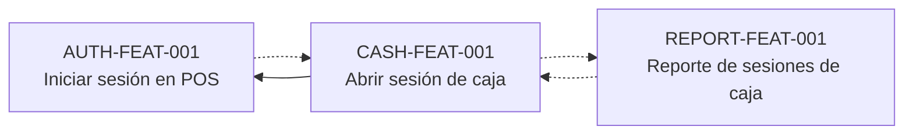

<!-- GENERADO por `tools/traceability/trace build`. No editar a mano. -->

# Mapa de dependencias

Leyenda: `A --> B` = A depende de B (`depends_on`); `A -.-> B` = relacionado (`related`).

## Quién depende de mí

| Feature | Dependientes (depends_on) | Relacionados (related) |
|---|---|---|
| AUTH-FEAT-001 | CASH-FEAT-001 | — |
| CASH-FEAT-001 | — | AUTH-FEAT-001, REPORT-FEAT-001 |
| REPORT-FEAT-001 | — | CASH-FEAT-001 |
